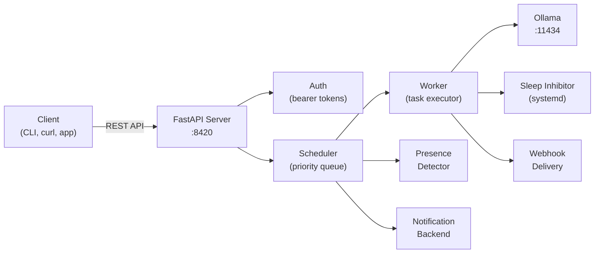
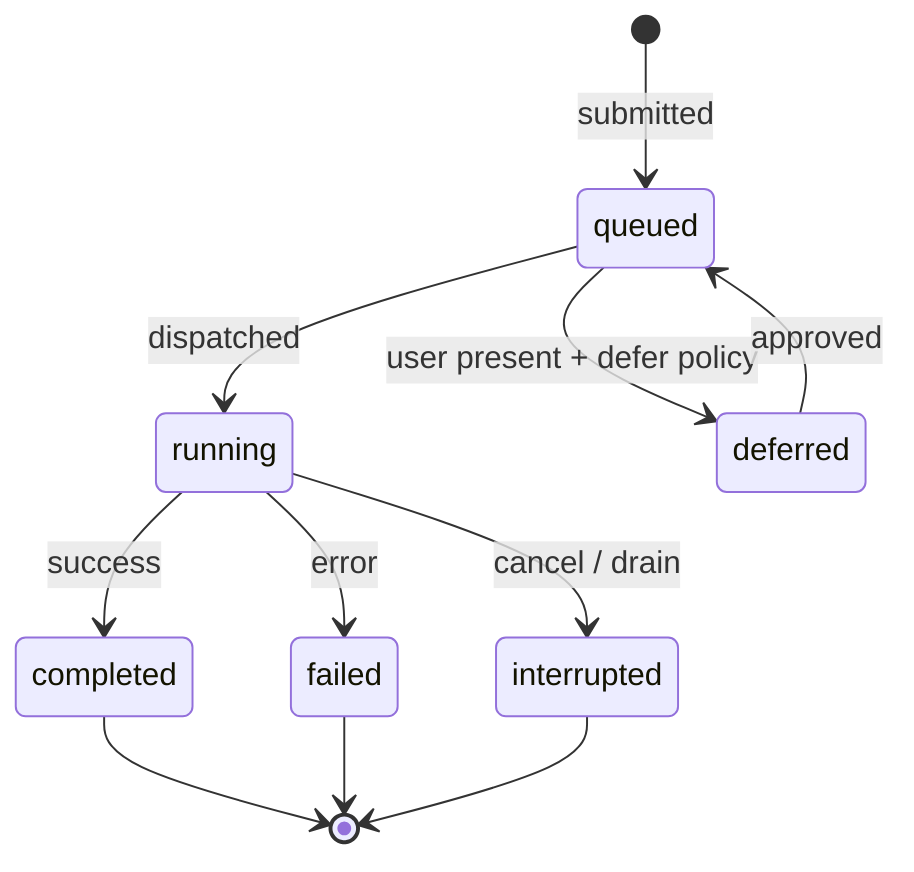

# Architecture

How Ringmaster works under the hood — the components, how they connect, and why they're designed this way.

## System overview

A client submits a task through the REST API. The server authenticates it, hands it to the scheduler, and the scheduler queues it by priority. When a slot is available, the worker picks the highest-priority task, acquires a sleep inhibitor, calls Ollama, stores the result, fires any webhook, and releases the inhibitor.

## Scheduler

The scheduler is the queue state machine. It owns all task lifecycle transitions that happen at the queue level (as opposed to execution results, which come from the worker).

### Task states

| State | Meaning |
|-------|---------|
| `queued` | Waiting in the priority queue |
| `deferred` | Held back because the user is present and `unattended_policy` is `defer` |
| `running` | Currently executing on Ollama |
| `completed` | Finished successfully, result available |
| `failed` | Ollama returned an error |
| `interrupted` | Cancelled by admin action or drain |

!!! info "Design decision: interrupted vs. cancelled vs. failed"
    These three terminal states have distinct causes. `failed` means Ollama hit an error. `interrupted` means the scheduler stopped the task externally (admin cancel, power event). A future `cancelled` state would mean the client withdrew the request before dispatch. Keeping them separate makes audit trails meaningful.

### Dispatch order

Tasks are dispatched in this order:

1. Priority — lower number first (1 is highest)
2. Deadline — tasks with deadlines jump ahead of tasks without; nearest deadline first
3. Submission time — within the same priority and deadline, first in first out

### Pause, resume, drain

These are in-memory flags, not database state. If Ringmaster crashes and restarts, it boots in the running state and picks up queued tasks — the safe default.

**Pause** stops dispatching but keeps accepting new tasks. The current task (if any) keeps running.

**Resume** returns to normal dispatch.

**Drain** is a graceful quiesce for planned power events:

- If no task is running: pause immediately.
- If a task is running: set a flag, wait for it to finish, then pause automatically.

This avoids interrupting a task mid-execution just because someone requested a shutdown.

## Worker

The worker executes one task per call. The dispatch loop calls `run_one()` repeatedly. Single-task granularity keeps the execution unit easy to test and reason about.

### Execution sequence

Each `run_one()` call follows this sequence:

1. Ask the scheduler for the next task
2. Acquire the sleep inhibitor (prevents suspend/shutdown)
3. Check user presence
4. If user is present, apply the `unattended_policy` (run / defer / notify)
5. If deferred, return without executing
6. If notification needed, send it and wait for approval or timeout
7. Load the model on Ollama (if not already loaded)
8. Run inference
9. Store the result in SQLite
10. Release the sleep inhibitor
11. Fire the webhook (if `callback_url` was set)
12. Notify the scheduler that the task completed
13. If draining, trigger the post-drain pause

!!! info "Design decision: inhibitor lifecycle"
    The inhibitor is acquired *before* calling Ollama and released in a `finally` block so it is always released, even if Ollama raises or the webhook delivery fails. A leaked inhibitor lock would permanently prevent the workstation from sleeping.

!!! info "Design decision: webhook after inhibitor release"
    `deliver_webhook` is called *after* releasing the inhibitor so that a slow webhook receiver doesn't extend the sleep-blocking window. The task is done — the workstation should be free to sleep even if the callback takes a while.

## GPU detection

Ringmaster identifies GPUs by hardware fingerprint, not PCI bus index.

**Why:** Bus indices can change across reboots, driver updates, or BIOS changes. A card that was `GPU 0` yesterday might be `GPU 1` today. Fingerprints use stable attributes: vendor, model, VRAM, and optionally serial number and PCI device ID.

### Match priority

1. **Serial match** — the board serial uniquely identifies a GPU. Most reliable, but not all drivers expose it without elevated privileges.
2. **Model + VRAM match** — when no serial is available. Uses a 5% VRAM tolerance to absorb firmware reservations (~1.2 GB on a 24 GB card).
3. **Model-only match** — last resort when VRAM is unreported. Less reliable but better than no match.

Detection runs at startup via `ringmaster init`, which calls `rocm-smi` (AMD) or `nvidia-smi` (NVIDIA), parses the output, and writes the fingerprint to `ringmaster.yaml`.

## Authentication

Ringmaster uses static bearer tokens stored in a JSON file (`tokens.json`).

!!! info "Design decision: why not OAuth?"
    The API is only meant to be accessible on a private home network. A full OAuth flow would add significant complexity without meaningful security benefit. Bearer tokens are simple, stateless, and appropriate for the threat model.

### How it works

- `POST /auth/register` issues a new token for a client ID. The raw token is returned once; only the SHA-256 hash is stored in `tokens.json`.
- `POST /auth/revoke` removes a client's access.
- Every other endpoint checks the `Authorization: Bearer <token>` header against the stored hashes.
- The `token_file` path in config defaults to `tokens.json`, resolved relative to the config file's directory.

### Bootstrap problem

The registration endpoint itself requires a token. The first token must be created out-of-band using a Python one-liner (see [Bootstrap authentication](../guide/installation.md#bootstrap-authentication) in the installation guide).

## Persistence

All task and session state is stored in SQLite with WAL mode enabled for concurrent read access. Timestamps are ISO 8601 UTC strings (not datetime objects) to keep the storage layer simple and timezone-agnostic.

The database file (`ringmaster.db`) lives next to the config file by default. It contains the task queue, task history, session records, and client registrations.

## What's next

Phase 2 (planned) adds multi-GPU task routing — matching tasks to specific GPUs based on role, VRAM requirements, and the `prefer_for` hints in your GPU config. This is where the fingerprint system pays off: each GPU has a stable identity that the scheduler can reason about.
